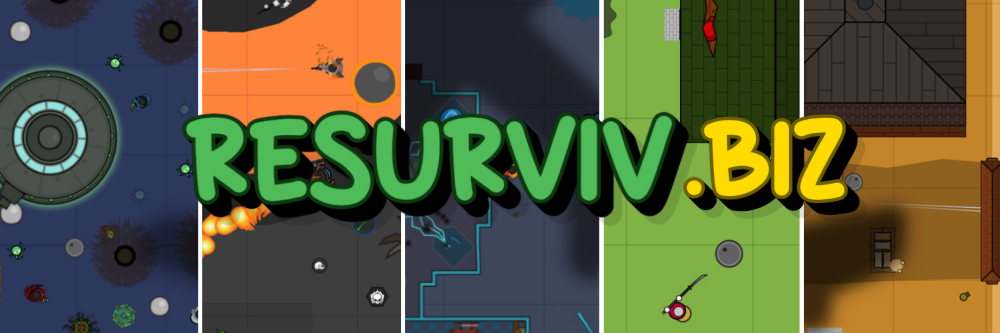

  

## Production server: https://resurviv.biz

# Open sourced surviv.io
resurviv.biz is an open source recreation of a hit web game "surviv.io" that has been permanently shut down.

Our goal is to immortalize it by getting the recreation as close as possible to the last canonical version of the game.

## Running locally

start client development server with `pnpm dev:client`

and server with `pnpm dev:server`

or cd into server and client directories and run `pnpm dev` for each

or pnpm -r dev from root folder to start all at once.

## Production builds
See [HOSTING.md](./HOSTING.md)
